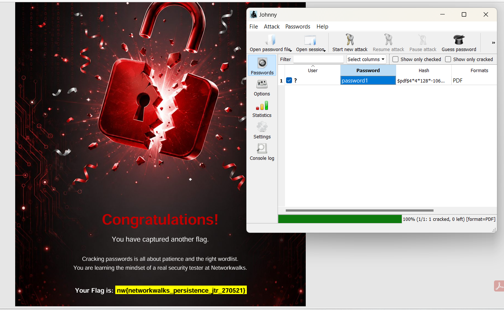
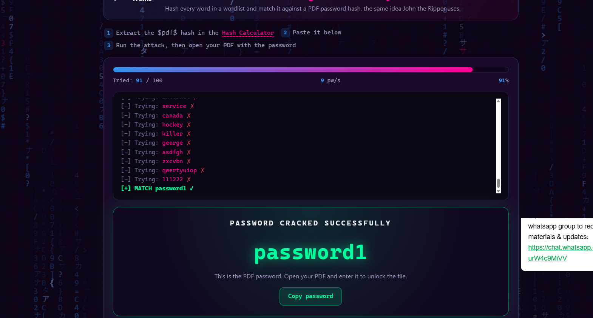
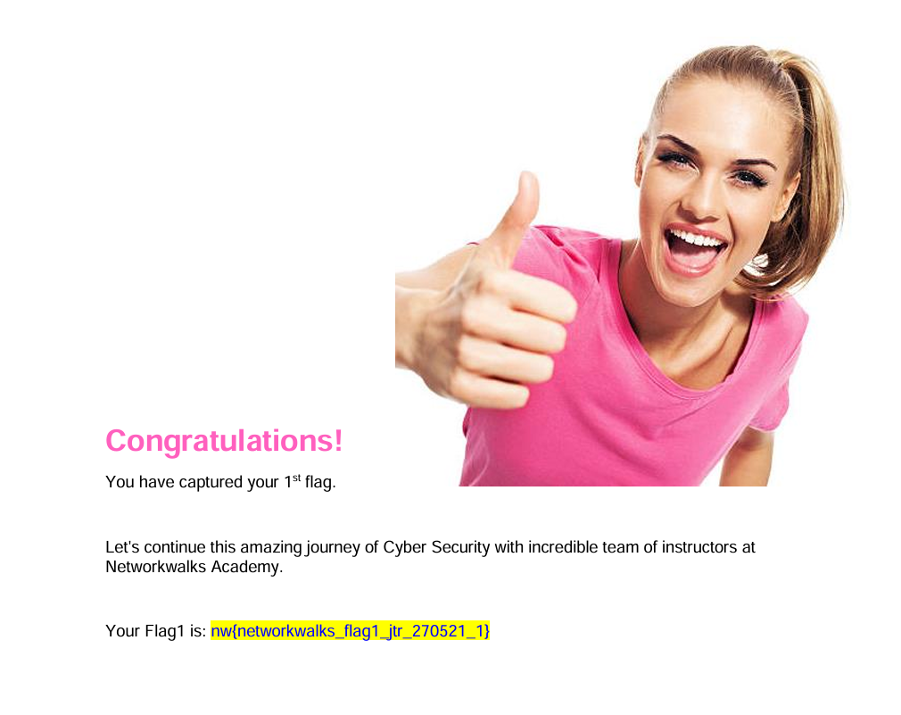

# Cryptographic Hash Analysis & Password Security Lab

## 📌 Project Overview
A practical security lab evaluating cryptographic structures in protected PDF files, extracting hash signatures, and assessing password entropy against dictionary-based recovery techniques.

> **Context:** Completed as part of practical lab modules during the Cybersecurity & Ethical Hacking Internship at **NetworkWalks Academy**, mentored by **Waqas Karim**.

---

## 🎯 Objectives
- Analyze hash extraction mechanisms from encrypted document formats.
- Evaluate the mechanics of dictionary attacks using John the Ripper (Johnny GUI) and custom security tools.
- Assess credential entropy and vulnerability risks associated with predictable passwords.
- Successfully capture CTF assessment flags.

---

## 🛠️ Practical Modules & Findings

### Module 1: Hash Evaluation with John the Ripper (Johnny GUI)
- **Hash Signature:** Extracted the `$pdf$` format hash representation from encrypted documents.
- **Analysis:** Configured Johnny GUI with core libraries, executed dictionary verification, and demonstrated how weak credential structures are susceptible to wordlist matching.

---

### Module 2: Analysis via NetworkWalks Security Cracker
- **Hash Verification:** Verified cryptographic hash integrity and entropy behavior.
- **Dictionary Attack Simulation:** Evaluated automated matching against common credential patterns.

---

## 🚩 CTF Flag Verification
Successfully validated the recovery workflow by decrypting challenge files and capturing the evaluation flags:
- Flag 1 Captured: Successfully verified via NetworkWalks tools.
- Flag 2 Captured: Successfully verified via Johnny GUI setup.

---

## 🛡️ Security Recommendations & Defensive Takeaways
1. **Password Complexity & Entropy:** Simple alphanumeric strings and dictionary words offer minimal defense against automated hash comparison. High-entropy passphrases must be enforced.
2. **Modern Encryption Algorithms:** Legacy document encryption methods should be updated to strong standards such as AES-256 with robust key derivation functions (PBKDF2/Argon2).
3. **Multi-Factor Authentication (MFA):** Document and identity access should incorporate secondary verification layers to mitigate risk from credential exposures.

---

## 👤 Author & Acknowledgments
- **Analyst:** Riya Patel
- **Mentor:** Waqas Karim
- **Organization:** NetworkWalks Academy
